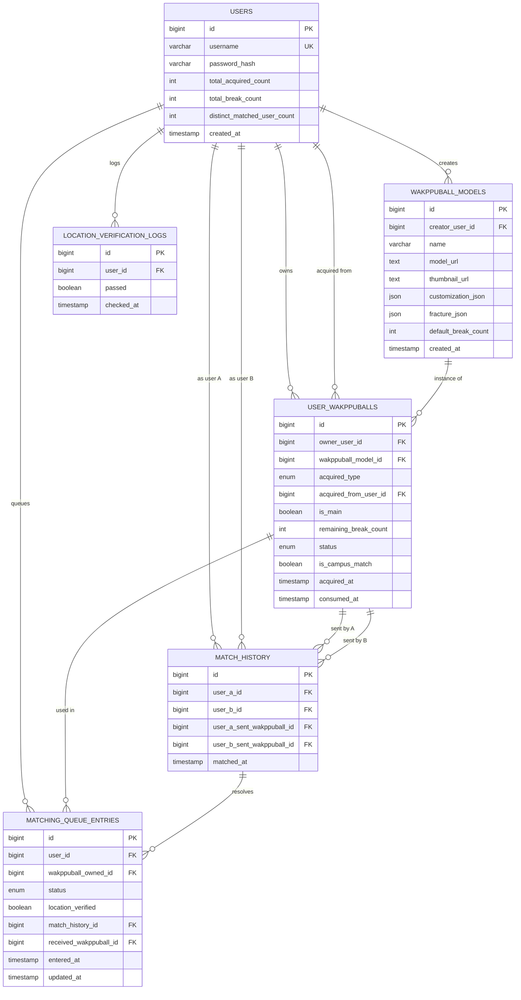

# 캠퍼스왁뿌볼 (campuswakppu)

> KAIST 몰입캠프 공통과제 I : 웹 기반 프로젝트 (2인 1팀)

**한 줄 소개:** 인터넷만 연결되어 있다면 언제 어디서든, 현실의 왁뿌볼을 그대로 만지고 뿌실 수 있는 온라인 스트레스 해소 서비스입니다. 간편하게 회원가입하고, 나만의 왁뿌볼을 만들어 다른 사람과 교환하며 만지작거려보세요.

**슬로건:** 왁뿌볼, 이제 사지 말고 접속하세요.

---

## 팀원

| 이름 | GitHub | 역할 |
|---|---|---|
| 김도현 | [KimDoDohyeon](https://github.com/KimDoDohyeon) | Backend, KCLOUD Deploy |
| 임유빈 | [lunar-yoobin](https://github.com/lunar-yoobin) | Frontend, 3D 모델 Three.js |

---

## 프로젝트 소개

### 기획 의도

현대인들은 쏟아지는 서비스와 빠르게 바뀌는 세상 속에서 늘 크고 작은 피로를 안고 살아간다. 캠퍼스왁뿌볼은 그런 사람들이 잠깐이라도 화면 앞에서 왁뿌볼을 조몰락거리며 스트레스를 내려놓고, 좋아하는 배경음악을 들으며 잠시 명상하듯 쉬어갈 수 있는 작은 온라인 휴식처를 만들고자 기획했다.

### 주요 기능

- **계정 생성 / 로그인** — 한글 유저네임을 지원하는 JWT 기반 회원가입·로그인
- **나만의 왁뿌볼 만들기** — 색상, 패턴, 두께를 직접 골라 커스터마이징
- **왁뿌볼 만지기** — 3D 모델을 회전·확대/축소하고, 눌러서 조각을 뿌시는 인터랙션 (React Three Fiber)
- **다른 사람과 교환하기** — 매칭 대기열을 통해 낯선 상대와 왁뿌볼을 교환, 캠퍼스 안에서 매칭되면 전용 뱃지 획득
- **내 컬렉션** — 내가 만든 왁뿌볼과 교환으로 받은 왁뿌볼을 한눈에 확인, 대표 왁뿌볼 지정
- **BGM 듣기** — 4가지 배경음악 중 원하는 트랙 선택
- **배경 테마 꾸미기** — 7가지 색상 × 2가지 톤, 총 14가지 배경 테마 중 선택
- **랭킹 조회하기** — 누적 뿌시기 횟수 / 누적 매칭 유저 수 기준 리더보드와 백분위 티어(마스터~브론즈) 확인

### 스크린샷 / 데모

<!-- 움짤 4개 이상 혹은 20초 이상의 데모 영상(또는 사진 4장 이상) 추가 예정 -->

---

## 시스템 아키텍처

```txt
┌─────────────────────────────────────────────────────────────────────────────┐
│                            Web Client (Frontend)                            │
│                                                                             │
│ ┌────────────┐ ┌────────────┐ ┌────────────┐ ┌────────────┐ ┌─────────────┐ │
│ │   Login    │ │ Main (3D)  │ │ Collection │ │  Matching  │ │ Leaderboard │ │
│ └────────────┘ └────────────┘ └────────────┘ └────────────┘ └─────────────┘ │
│                                                                             │
│                          REST (fetch) + JWT Bearer                          │
└─────────────────────────────────────────────────────────────────────────────┘
                                       │
┌─────────────────────────────────────────────────────────────────────────────┐
│                         Express Backend (TypeScript)                        │
│                                                                             │
│      ┌────────┐ ┌────────┐ ┌─────────────┐ ┌────────────┐ ┌──────────┐      │
│      │  Auth  │ │ Users  │ │ Wakppuballs │ │ Collection │ │ Matching │      │
│      └────────┘ └────────┘ └─────────────┘ └────────────┘ └──────────┘      │
│                                                                             │
│                         Leaderboard / Stats (Tiers)                         │
│                                                                             │
│                                  Prisma ORM                                 │
└─────────────────────────────────────────────────────────────────────────────┘
                                       │
┌─────────────────────────────────────────────────────────────────────────────┐
│                                  PostgreSQL                                 │
│                      (Users / Balls / Matches / Queue)                      │
└─────────────────────────────────────────────────────────────────────────────┘

                      Deploy: KCLOUD (infra/aws-notes.md)
```

---

## 기술스택

### Frontend

| 기술 | 구현한 기능 |
|---|---|
| React 18 + TypeScript | 화면별 컴포넌트, 4가지 상태(로딩/에러/빈 상태/성공) 처리 |
| React Router | 로그인/메인/컬렉션/매칭 페이지 라우팅 |
| Vite | 개발 서버, 번들링, 백엔드 API 프록시 |
| Three.js + @react-three/fiber + drei | 왁뿌볼 3D 모델 렌더링, 회전/줌/프레스-뿌시기 인터랙션 |
| CSS Custom Properties | 라바램프 배경 애니메이션, 글래스모피즘 UI, 14색 배경 테마 시스템 |
| Vitest + Testing Library | 컴포넌트 단위 테스트 |

### Backend

| 기술 | 구현한 기능 |
|---|---|
| Express + TypeScript | REST API 서버, 모듈별 라우터(auth/users/wakppuballs/collection/matching/leaderboard) |
| Prisma + PostgreSQL | ORM, 스키마 마이그레이션 |
| jsonwebtoken + bcrypt | 로그인 인증(JWT 발급/검증), 비밀번호 해싱 |
| Zod | 요청 바디 검증 |
| Docker Compose | 로컬 개발용 PostgreSQL 컨테이너 |

### Infra

| 기술 | 용도 |
|---|---|
| KCLOUD | 백엔드/DB 배포 |

---

## Getting Started

```bash
# 1. 의존성 설치 (workspace 루트에서)
npm install

# 2. 환경 변수 설정
cp .env.example .env
# DATABASE_URL, JWT_SECRET 등을 채운다

# 3. 로컬 PostgreSQL 실행 (Docker)
npm run db:dev

# 4. DB 마이그레이션 적용
cd backend && npx prisma migrate dev && cd ..

# 5. 백엔드 실행 (http://localhost:3000)
npm run dev:backend

# 6. 프론트엔드 실행 (http://localhost:5173, /api는 3000번으로 프록시)
npm run dev:frontend
```

테스트: `npm test -w frontend`

---

## 기획안

> 아직 미완성, 추후 작성 예정

---

## 기능 명세서

> 아직 미완성, 추후 작성 예정

---

## IA 및 화면 설계서

- [와이어프레임](docs/캠퍼스왁뿌볼_와이어프레임.png)
- [개별 화면 설계](docs/캠퍼스왁뿌볼_개별화면.pdf)

---

## DB 스키마



---

## API 문서

| 그룹 | 주요 엔드포인트 |
|---|---|
| 인증 Auth | `POST /auth/signup`, `POST /auth/login` |
| 유저 Users | `GET /users/me`, `PATCH /users/me` |
| 왁뿌볼 Wakppuballs | `GET /wakppuballs/me/main`, `POST /wakppuballs`, `PATCH /wakppuballs/me/created`, `POST /wakppuballs/:ownedId/break` |
| 컬렉션 Collection | `GET /collection`, `POST /collection/:ownedId/select-main` |
| 매칭 Matching | `POST /matching/queue`, `DELETE /matching/queue`, `GET /matching/status` |
| 리더보드 Leaderboard | `GET /leaderboard` |

전체 요청/응답 스펙, 에러 코드, 필드 설명은 [API 문서](docs/api.md)에 정리되어 있다.

---

## 프로젝트 구조

```txt
26s-w1-c2-02/
├── frontend/                 # React + Vite 클라이언트
│   ├── src/
│   │   ├── features/         # 화면별 기능 단위 (auth, wakppuball, collection, matching, leaderboard)
│   │   ├── shared/           # 공통 API 클라이언트, 인증, 사운드, 테마, 뱃지 유틸
│   │   └── assets/           # 3D 모델(GLB), 패턴 텍스처
│   └── public/               # 정적 파일 (BGM/효과음, 티어·캠퍼스 뱃지 이미지)
├── backend/                  # Express + TypeScript API 서버
│   ├── src/
│   │   ├── modules/          # auth, users, wakppuballs, collection, matching, leaderboard, stats
│   │   └── common/           # 인증 미들웨어, 공통 에러 처리 등
│   └── prisma/                # DB 스키마 및 마이그레이션
├── docs/                      # API 문서, DB 스키마, 3D 에셋 계약, 와이어프레임 등 설계 문서
├── infra/                     # 로컬 개발/배포 인프라 메모 (Docker, KCLOUD)
└── README.md
```

---

## 배포 결과물

> 접속 가능한 링크, 실행 방법, 주요 구현 내용

- **서비스 URL:**
- **실행 방법:** [Getting Started](#getting-started) 참고
- **주요 구현 내용:** 회원가입/로그인, 왁뿌볼 생성 및 3D 인터랙션(회전/줌/뿌시기), 매칭을 통한 왁뿌볼 교환(캠퍼스 매칭 뱃지 포함), 내 컬렉션 관리, BGM/배경 테마 커스터마이징, 리더보드 및 티어 시스템

---

## 회고 문서

> 개발 과정에서의 어려움, 해결 방법, 역할 분담, 다음에 개선할 점 (KPT 방법론 참고)
>
> 아직 미완성, 추후 작성 예정

### Keep

### Problem

### Try

---

## 참고 자료

- [SDD(스펙 주도 개발) 이해하기](https://news.hada.io/topic?id=21338)
- [Software Design Document Best Practices](https://www.atlassian.com/work-management/project-management/design-document)
- [IA 정보구조도 작성 방법](https://brunch.co.kr/@nyonyo/7)
- [기획자 화면설계서 작성법](https://brunch.co.kr/@soup/10)
- [Figma 와이어프레임 가이드](https://www.figma.com/ko-kr/resource-library/what-is-wireframing/)
- [무료 Figma 와이어프레임 키트](https://www.figma.com/ko-kr/templates/wireframe-kits/)
- [ERD/DB 설계 총정리](https://inpa.tistory.com/entry/DB-%F0%9F%93%9A-%EB%8D%B0%EC%9D%B4%ED%84%B0-%EB%AA%A8%EB%8D%B8%EB%A7%81-%EA%B0%9C%EB%85%90-ERD-%EB%8B%A4%EC%9D%B4%EC%96%B4%EA%B7%B8%EB%9E%A8)
- [API 명세서 작성 가이드라인](https://velog.io/@sebinChu/BackEnd-API-%EB%AA%85%EC%84%B8%EC%84%9C-%EC%9E%91%EC%84%B1-%EA%B0%80%EC%9D%B4%EB%93%9C-%EB%9D%BC%EC%9D%B8)
- [좋은 README 작성하는 방법](https://velog.io/@sabo/good-readme)
- [단기 프로젝트 회고 KPT 방법론](https://velog.io/@habwa/%EB%8B%A8%EA%B8%B0-%ED%94%84%EB%A1%9C%EC%A0%9D%ED%8A%B8-%ED%9A%8C%EA%B3%A0-KPT-%EB%B0%A9%EB%B2%95%EB%A1%A0)
